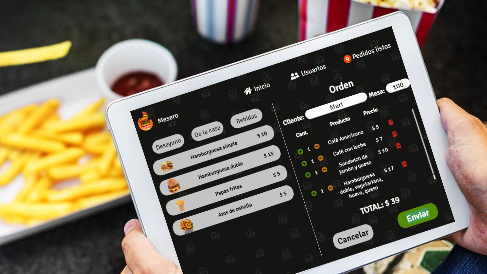
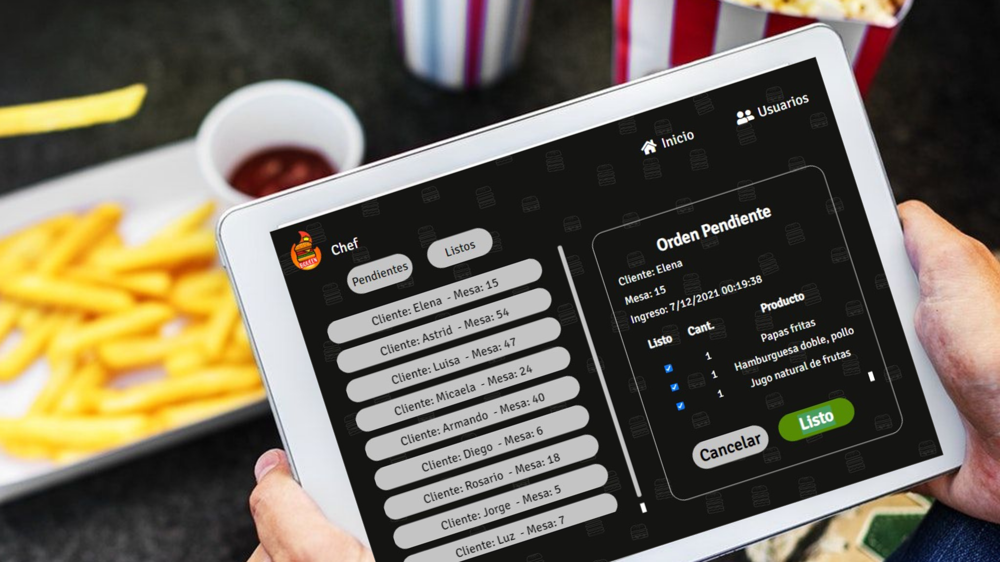
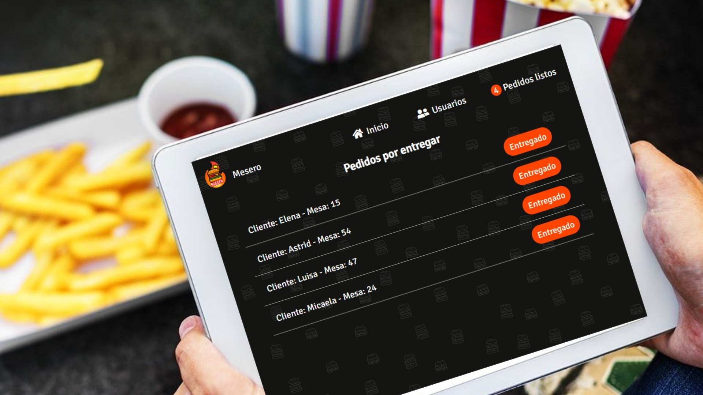

# 🍔Burger Queen👑

## Índice

- [1. Resumen del proyecto](#1-resumen-del-proyecto)
- [2. Historias de usuario](#2-historias-de-usuario)
- [3. Objetivos de aprendizaje](#3-objetivos-de-aprendizaje)

---

## 1. Resumen del proyecto

El restaurante 🍔**Burguer Queen**👑, necesita una interfaz en la que puedan tomar pedidos usando una _tablet_ 📱, y enviarlos a la cocina para que se preparen en forma ordenada y eficiente.

El usuario puede ir eligiendo y agregando los productos, y la interfaz va mostrando el resumen del pedido con el total a pagar.

---

## 2. Historias de usuario

### 📋 2.1. Historia de usuario 1:

_Meserx debe poder tomar pedido de cliente_

- 🤵Yo como meserx.
- 📝Quiero tomar el pedido de un cliente.
- 💡 Para no depender de mi mala memoria, para saber cuánto cobrar, y enviarlo a la cocina para evitar errores y que se puedan ir preparando en orden.

**Criterios de aceptación**

- ✅ Anotar nombre de cliente.
- ✅ Agregar productos al pedido.
- ✅ Eliminar productos.
- ✅ Ver resumen y el total de la compra.
- ✅ Enviar pedido a cocina (guardar en una base de datos).
- ✅ Se ve y funciona bien en una _tablet_.

### 📋 2.2. Historia de usuario 2:

_Jefe de cocina debe ver los pedidos_

- 👩‍🍳 Yo como jefx de cocina
- 👀 Quiero ver los pedidos de los clientes en orden y marcar cuáles están listos
- 🍽 Para saber qué se debe cocinar y avisar a lxs meserxs que un pedido está listo para servirlo a un cliente.

**Criterios de aceptación**

- ✅ Ver los pedidos ordenados según se van haciendo.
- ✅ Marcar los pedidos que se han preparado y están listos para servirse.
- ✅ Ver el tiempo que tomó prepara el pedido desde que llegó hasta que se
  marcó como completado.

  

### 📋 2.3 Historia de usuario 3:

_Meserx debe ver pedidos listos para servir_

- 🤵 Yo como meserx.
- 👀 Quiero ver los pedidos que están preparados.
- 🍽 Para entregarlos rápidamente a los clientes que las hicieron.

**Criterios de aceptación**

- ✅ Ver listado de pedido listos para servir.
- ✅ Marcar pedidos que han sido entregados.

## 

## 3. Objetivos de aprendizaje

### 📚 HTML

- [x] **Uso de HTML semántico**

### 📚 CSS

- [x] **Uso de selectores de CSS**
- [x] **Modelo de caja (box model): borde, margen, padding**
- [x] **Uso de flexbox en CSS**
- [x] **Uso de CSS Grid Layout**
- [x] **Uso de media queries**

### 📚 JavaScript

- [x] **Arrays (arreglos)**
- [x] **Objetos (key, value)**
- [x] **Diferenciar entre tipos de datos primitivos y no primitivos**
- [x] **Uso de condicionales (if-else, switch, operador ternario, lógica booleana)**
- [x] **Funciones (params, args, return)**
- [ ] **Pruebas unitarias (unit tests)**
- [ ] **Pruebas asíncronas**
- [ ] **Uso de mocks y espías**
- [x] **Módulos de ECMAScript (ES Modules)**
- [x] **Uso de linter (ESLINT)**
- [x] **Uso de identificadores descriptivos (Nomenclatura y Semántica)**
- [x] **Diferenciar entre expresiones (expressions) y sentencias (statements)**
- [x] **Callbacks**
- [x] **Promesas**

### 📚 Control de Versiones (Git y GitHub)

- [x] **Git: Instalación y configuración**
- [x] **Git: Control de versiones con git (init, clone, add, commit, status, push, pull, remote)**
- [x] **Git: Integración de cambios entre ramas (branch, checkout, fetch, merge, reset, rebase, tag)**
- [x] **GitHub: Creación de cuenta y repos, configuración de llaves SSH**
- [x] **GitHub: Despliegue con GitHub Pages**
- [x] **GitHub: Colaboración en Github (branches | forks | pull requests | code review | tags)**
- [x] **GitHub: Organización en Github (projects | issues | labels | milestones | releases)**

### 📚 UX (User eXperience)

- [x] **Diseñar la aplicación pensando en y entendiendo al usuario**
- [x] **Crear prototipos para obtener feedback e iterar**
- [x] **Aplicar los principios de diseño visual (contraste, alineación, jerarquía)**
- [x] **Planear y ejecutar tests de usabilidad**

### 📚 Firebase

- [x] **Firebase Auth**
- [x] **Firestore**

### 📚 React

- [x] **JSX**
- [x] **Componentes y propiedades (props)**
- [x] **Manejo de eventos**
- [x] **Listas y keys**
- [x] **Renderizado condicional**
- [x] **Elevación de estado**
- [x] **Hooks**
- [x] **CSS modules**
- [x] **React Router**
